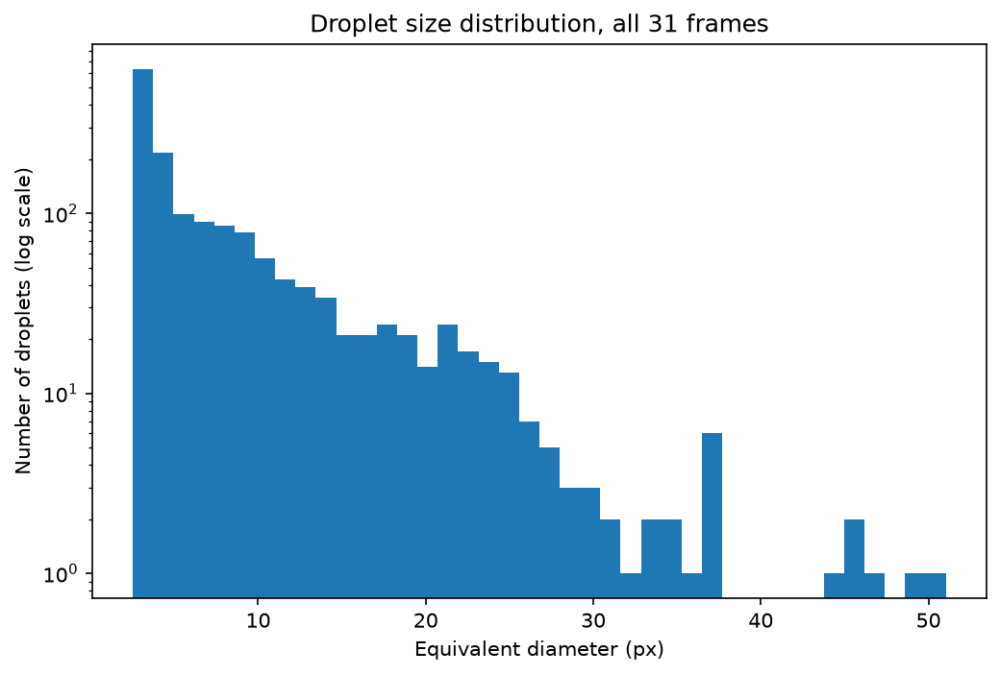

# Droplet Vision

## Computer Vision and Data Analysis for Automated Droplet Detection and Measurement

**Droplet Vision** is an ongoing research and development project focused on developing computational methods for the analysis of high-speed imaging data of liquid jets, droplets, and breakup processes.

The project combines **Python programming, data processing, computer vision, image analysis, machine learning, and deep learning** to develop an automated and scalable approach for extracting meaningful quantitative information from experimental imaging data.

## Project Scope

The project explores different stages of an automated data-analysis pipeline:

- Python programming and scientific computing
- Data organization, processing, and analysis
- File and dataset management
- Image preprocessing and enhancement
- Computer vision and image analysis
- Image segmentation and object detection
- Droplet size and shape measurement
- Droplet position and velocity estimation
- Object tracking across consecutive frames
- Analysis of liquid jet breakup and droplet formation
- Statistical analysis and visualization
- Processing of large experimental datasets
- Machine learning and deep learning
- Model training, evaluation, and validation
- Automation and reproducible computational workflows

## Planned Approach

The project is being developed progressively, starting with fundamental programming and data-processing techniques and advancing toward more sophisticated computer vision and AI-based approaches.

The initial development includes:

- Python programming
- NumPy and Pandas for numerical and experimental data analysis
- File and dataset management
- Data visualization
- Image preprocessing
- Classical computer vision techniques
- Object detection and segmentation
- Feature extraction and measurement

Future stages will investigate **machine-learning and deep-learning methods** for challenging imaging conditions, including small, overlapping, blurred, rapidly moving, and partially fragmented droplets.

## Research Context

The project is motivated by experimental research on **liquid jet breakup and droplet formation in a gaseous environment**.

High-speed imaging produces large amounts of visual data containing information about the evolution of liquid structures over time. The objective is to develop computational methods that can convert these images into quantitative measurements for the analysis of:

- Breakup dynamics
- Droplet characteristics
- Spray behavior
- Droplet size distributions
- Droplet trajectories and velocities
- Temporal evolution of liquid structures

## Development Direction

The long-term goal is to develop a general **computer vision and AI-based pipeline** capable of processing experimental imaging datasets with minimal manual intervention.

Potential future developments include:

- Automated dataset generation and labeling
- Advanced image segmentation
- Object detection
- Multi-frame object tracking
- Machine learning
- Deep learning
- Feature extraction
- Model training and evaluation
- Performance optimization
- Automated visualization and reporting
- Integration of different computational tools

## Current Status

🚧 **In Development**

The current stage focuses on building the foundations of the computational workflow, including **Python programming, data handling, file management, numerical analysis, and the development of computer vision techniques**.

The project will progressively expand toward advanced computer vision, machine learning, and deep learning methods while evaluating their performance on experimental high-speed imaging data.

## Usage

Requires Python 3.10+.

```
python -m venv venv
venv\Scripts\activate
python -m pip install -r requirements.txt
python src\droplet_detect.py "path\to\image\folder" --output data\droplets.csv
```

Optional settings: `--threshold` (default 110), `--min-area` (default 5 pixels), `--max-area` (default 2500 pixels), `--min-circ-area` (default 30 pixels).

## Output

One row per detected droplet. Columns: `filename`, `id`, `area_px`, `equiv_diameter_px`, `centroid_x`, `centroid_y`, `perimeter_px`, `circularity`, `dist_to_jet_px` (distance to the main jet, taken as the largest connected region).
Example result on 31 high-speed frames (1,583 droplets):



## Current Method

1. Take the red channel of each frame (OpenCV loads colour as BGR, so red is index 2)
2. Threshold: pixels darker than the threshold count as liquid
3. Label connected regions (8-connectivity)
4. Keep regions between `min-area` and `max-area` pixels as droplet candidates
5. Measure each one with scikit-image `regionprops`

## Known Limitations

- Pixel-exact connectivity means some bumps on the jet's edge are counted as separate droplets, so counts are an upper estimate rather than ground truth.
- Closing, opening and a Sobel sharpness filter were tested on one frame and did not remove these false detections (details in `notes.md`).
- Circularity is only reported for droplets of 30 pixels or more, because the perimeter of smaller blobs is too coarse (values above 1 appeared below that size).
- Most droplets are only 3 to 5 pixels across, so their diameters are coarse (a one-pixel error is about 25%).
- Sizes are in pixels; no spatial calibration has been applied yet.
- Counts are not directly comparable with the earlier matplotlib-based version of the script (`data/results.csv`, `data/droplet_counts_per_frame.csv`): OpenCV joins diagonal neighbours and decodes the TIFFs with 1-level differences. On frame 0 the count went from 49 to 42.
- Distance to the jet shows no natural cutoff: of 1,583 detections over 31 frames, 26% are within 3 px of the jet, 37% within 5 px and 48% within 8 px. Counts per frame are therefore best reported as a range, 29 to 72 (mean 51) for all detections and 17 to 54 (mean 38) excluding those within 3 px.
